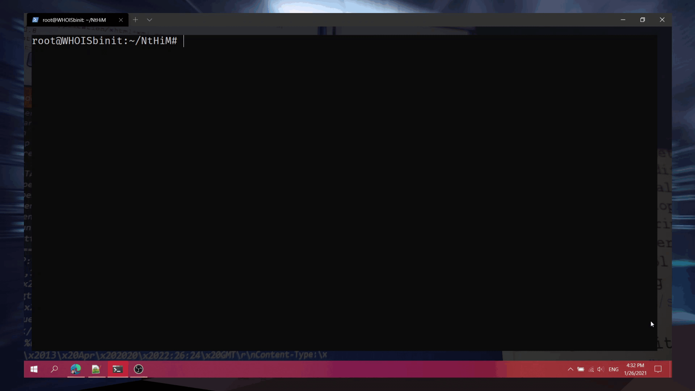
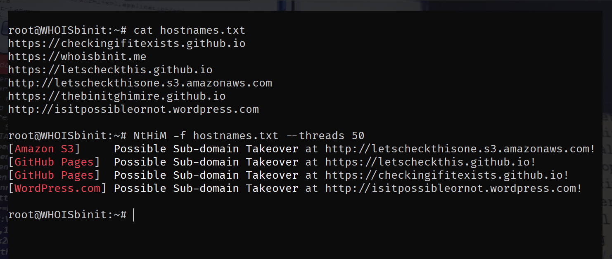

<!-- NtHiM | Now, the Host is Mine! - Super Fast Sub-domain Takeover Detection! -->

<p align="center">
        <a href="https://github.com/TheBinitGhimire/NtHiM/stargazers" target="_blank"></a>
        &nbsp;&nbsp;&nbsp;
        <a href="https://github.com/TheBinitGhimire/NtHiM/network/members" target="_blank"></a>
        &nbsp;&nbsp;&nbsp;
        <a href="https://github.com/TheBinitGhimire/NtHiM/issues" target="_blank"></a>
        <br />
        
        <br />
        &nbsp;&nbsp;&nbsp;
        <a href="https://github.com/TheBinitGhimire/NtHiM/releases" target="_blank"></a>
        &nbsp;&nbsp;&nbsp;
        <a href="https://crates.io/crates/NtHiM" target="_blank"></a>
</p>


***


<h3 align="center"> NtHiM - Super Fast Sub-domain Takeover Detection </h3>
<p align="center">
    <a href="https://github.com/TheBinitGhimire/NtHiM/releases/tag/0.0.3"></a>
    &nbsp;&nbsp;
    <a href="https://www.rust-lang.org/" target="_blank"></a>
</p>


***

## Installation

### Method 1: Using Pre-compiled Binaries
The pre-compiled binaries for different systems are available in the [**Releases**](https://github.com/TheBinitGhimire/NtHiM/releases) page. You can download the one suitable for your system, unzip the file and start using NtHiM.

### Method 2: Using Crates.io
**NtHiM** is available on **[Crates.io](https://crates.io/crates/NtHiM)**. So, if you have Rust installed on your system, you can simply install **NtHiM** with the following command:

```bash
cargo install NtHiM
```

### Method 3: Manual Build
You will need Cargo to perform the manual build for NtHiM.
If you have Cargo installed, you can simply follow the steps below:
1. Clone this repository, `git clone https://github.com/TheBinitGhimire/NtHiM`;
2. Go inside the folder, `cd NtHiM`;
3. Use the `cargo build` command,
4. Go inside the newly-created **target** folder, and open the **debug** folder inside it, `cd target/debug`;
5. You will find **NtHiM.exe** (on Microsoft Windows) or **NtHiM** binary (on Linux).

***

## Usage

| Flag  | Description                         | Example                                  |
| ----- | ----------------------------------- | ---------------------------------------- |
|  -h   | Display help related to usage!      | NtHiM -h                                 |
|  -t   | Scan a single target!               | NtHiM -t https://example.example.com     |
|  -f   | Scan a list of targets from a file! | NtHiM -f hostnames.txt                   |
|  -c   | Number of Concurrent Threads!       | NtHiM -c 100 -f hostnames.txt            |
|   -V  | Display the version information!    | NtHiM -V                                 |

***

### Use Case 1 (Single Target):

```bash
NtHiM -t https://example.example.com
```

### Use Case 2 (Multiple Targets):

```bash
NtHiM -f hostnames.txt
```

***

### Usage Demonstration:



***

## Examples

### Single Target


### Multiple Targets using Concurrent Threads


***

## Workflow

### Platform Identification
**NtHiM** uses the data provided in **[EdOverflow/can-i-take-over-xyz](https://github.com/EdOverflow/can-i-take-over-xyz)** for the platform identification.

***

## Frequently Asked Questions (FAQs)
If you have any questions regarding **NtHiM**, please raise an issue by going to the **[Issues](https://github.com/TheBinitGhimire/NtHiM/issues)** page.

Some of your queries might have been answered in one of the existing issues, so please make sure to check the Issues with the **[FAQ](https://github.com/TheBinitGhimire/NtHiM/issues?q=is%3Aissue+label%3AFAQ)** label before raising an issue on your own.

***

## Contributions and Feature Requests
<p align="center">
    <a href="https://github.com/TheBinitGhimire/NtHiM/pulls"></a>
</p>


If you are interested in contributing in the development of <strong>NtHiM</strong>, you can feel free to create a <strong>Pull Request</strong> with modifications in the original code, or you shall open up a new <strong>issue</strong>, and I will try to include the feature as requested.

There is no restriction on anyone for contributing to the development of <strong>NtHiM</strong>. If you would like to contribute, you can feel free to do so.

